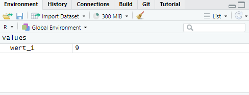

# Variablen und Datentypen in `R` {#sec-r-types}

```{r}
#| echo: false
#| warning: false
#| message: false
source('_common.R')
knitr::opts_chunk$set(
  prompt = TRUE,
  echo = TRUE
)
```

Wie in der Beispielanwendung bereits gezeigt, besteht der Umgang mit `R` vor allem in der Benutzung von verschiedenen Befehlen. Die Befehle bzw. Anweisungen, werden an `R` auf der Kommandozeile übergeben. `R` liest die Anweisungen ein und führt entsprechende Operationen durch. Im einfachsten Fall, kann `R` beispielsweise als ein überproportionierter Taschenrechner verwendet werden. In RStudio und in Posit ist die Kommandozeile üblicherweise unten links zu sehen und signalisiert durch das Prompt `>` die Bereitschaft, Befehle annehmen zu können. Beispielsweise führt der folgende Befehl `2 + 2` auf der Kommandozeile gefolgt von einem , zu folgender Ausgabe:

```{r}
#| echo: true

2 + 2
```

Die Ausgabe wird in einzelne Zeilen umgebrochen, wenn die Ausgabe zu lang ist und die Zeilen werden durchnummeriert.Die `[1]` kennzeichnet daher die erste Zeile der von `R` generierten Ausgabe.

Die Kommandozeile in `R` funktioniert nach dem Prinzip einer sogenannten **REPL**. REPL ist eine Abkürzung für die englischen Begriffe read-eval-print-loop. Die Eingabe wird durch `R` eingelesen (R), im Rahmen der Programmiersprache evaluiert (E), das Ergebnis wird ausgegeben (P) und anschließend geht die Kommandozeile zurück zum Ausgangszustand (L). D.h. im Beispiel eben liest `R` die Eingabe `2 + 2`, und evaluiert diese Anweisung. Die Evaluation führt zu dem Ergebnis `4` und das Ergebnis wird wieder auf der Kommandozeile ausgegeben. Anschließend geht die Kommandozeile zurück in den Ausgangszustand und wartet auf die nächste Eingabe `>`. Wenig überraschend, führt die Eingabe `3 * 3` entsprechend zu folgender Ausgabe.

```{r}
#| echo: true

3 * 3
```

Da längere Analysen selten nur auf der Kommandozeile durchgeführt werden, sondern auch Skripte im Editor benutzt werden, gibt es in RStudio es ein Tastenkürzel, um den Fokus auf die Kommandozeile zu setzen .

In der Kommandozeile in `R` ist es nach der Ausführung einer Anweisung nicht möglich mit dem Cursor wieder nach oben zu gehen und eine fehlerhaften Eingabe zu berichtigen. Sondern die komplette Anweisung muss noch einmal eingegeben werden. Allerdings merkt sich RStudio die Befehle und mit den Pfeiltasten  und  können diese wieder aufgerufen werden und entsprechend angepasst werden.

Die Anweisungen `2 + 2` oder `3 * 3` werden allgemein als **Ausdrücke** bezeichnet.

::: {#def-r-expression}
### Ausdruck (engl. expression)

Ein Ausdruck ist ein Teil eines Programms, der durch die Programmiersprache ausgewertet wird und genau einen Wert erzeugt.
:::


::: {#exm-r-expression-1}
### Subtraktion und Division

```{r}
#| echo: true

10 - 3
12 / 4
```

:::

Als nächstes seien nun komplexe komplexere, mehrstufige Anweisungen betrachtet, mit denen zum Beispiel komplexere Berechnungen durchgeführt werden können. Dazu wird allerdings ein zentrales Konzept von Programmiersprachen benötigt, das der **Variablen**.

## Variablen in `R`

Nehmen wir an, wir wollen das Ergebnis einer komplexen Berechnung in irgendeiner Form weiter verwenden. Die im Beispiel berechnete `9` steht nach der Ausgabe allerdings für die weitere Bearbeitung nicht mehr zur Verfügung. `R` hat die REPL ausgeführt, das Ergebnis war die Berechnung von `9`, und da mit der Ausgabe nichts Weiteres durchgeführt wurde, ist die Ausgabe auch nirgends gespeichert worden. Die Ausgabe bzw. das Ergebnis eines Ausdrucks wird als **Rückgabewert** \index{Rückgabewert} bezeichnet. Um den Rückgabewert eines Ausdrucks weiter zu bearbeiten, muss dieser Wert in irgendeiner Form in `R` gespeichert werden. Um Werte weiter verwenden zu können, wird den Werten daher ein **Bezeichner** \index{Bezeichner}, ein Name, zugewiesen. Es wird eine Variable definiert. Erfahrungsgemäß stellt dieses Konzept eine erste größere Hürde im Umgang mit `R` dar. Da zum Beispiel im Rahmen von Tabellenkalkulationsprogrammen Variablen selten eine Rolle ist oft diese Konzept nicht geläufig. Letztendlich ist eine Variable aber nichts anderes als ein Wert in `R` dem ein Bezeichner zugewiesen wurde.

::: {#def-variable}
## Variable \index{Variable}

Eine Variable ist ein Symbol oder ein Bezeichner, der verwendet wird, um einen Wert oder eine Datenstruktur zu speichern. Eine Variable dient als Referenz auf diesen Wert. Über den Bezeichner kann der Wert jederzeit abgerufen oder auch verändert werden.
:::


Um in `R` einem Ausdruck bzw. dessen Rückgabewert einen Namen zuzuweisen, wird ein spezieller, in `R` definierter Befehl verwendet, der **Zuweisungsoperator** \index{Zuweisungsoperator} `<-`. Soll beispielsweise das Ergebnis der „komplexen“ Berechnung `3 * 3` später weiter verwendet werden, dann kann mit Hilfe des Zuweisungsoperators `<-` dem Rückgabewert ein Bezeichner gegeben werden. 

```{r}
#| echo: true

wert_1 <- 3 * 3
```


Bei einer Zuweisung gibt `R` keinen Ausdruck mehr zurück, da das Ergebnis des Zuweisungsoperators die Zuweisung eines Namens ist. Diese Operation gibt keinen Wert zurück. Intern hat `R` die Berechnung durchgeführt und dem Rückgabewert den Namen `wert_1` zugewiesen. Der Name ist dabei, im Rahmen bestimmter Konventionen, vollkommen willkürlich und `R` hätte mich nicht daran gehindert `wert_2`, `wert_123`, `thomas`, `steffie` oder einen anderen Namen zu verwenden. 

::: {.callout-tip}
Die aktuell definierten Bezeichner sind in RStudio und Posit oben rechts unter dem Reiter **Environment** zu sehen.


:::

Der Wert kann nun über den Bezeichner wiederverwendet werden. D.h. die Eingabe des Namens `wert_1` auf der Kommandozeile führt dazu, dass `R` den Wert zurückgibt. Der Wert und der Bezeichner sind nun gleichwertig miteinander. Überall wo ich den Wert $9$ verwenden kann, kann nun auch der Bezeichner `wert_1` verwendet werden.

```{r}
#| echo: true

wert_1
```

Dieser Prozess funktioniert genauso mit einem komplexeren Ausdruck wie `2 + 2 * 4`.

```{r}
#| echo: true 

x <- 2 + 2 * 4
```

Der Aufruf des Bezeichners `x` von auf der Kommandozeile führt dann entsprechend wieder zu der Ausgabe des Wertes.

```{r}
#| echo: true
x
```

Konzeptionell stellt sich der Vorgang der Zuweisung in etwa so dar. Im internen Speicher von `R` wird der Wert $10$ an einer passenden Stelle abgespeichert und in einer Tabelle wird ein Eintrag mit dem Bezeichner `x` zusammen mit der Adresse des Wertes $10$ abgelegt (siehe @fig-r-vars-variable). 

```{r}
#| echo: false
#| fig-cap: "Konzept einer Variable"
#| label: fig-r-vars-variable

df <- data.frame(
  x = c(1, 2),
  y = c(1, 1),
  label = c("Variable:\nname", "Wert im\nArbeitsspeicher:\n42")
)

ggplot(df) +
  geom_rect(data = tibble(xmin=0, xmax=1, ymin=0, ymax=1),
            aes(xmin=xmin,xmax=xmax,ymin=ymin,ymax=ymax), fill='lightgray') +
  geom_rect(data = tibble(xmin=1.1, xmax=2.1, ymin=0, ymax=1),
            aes(xmin=xmin,xmax=xmax,ymin=ymin,ymax=ymax), fill='lightgray') +
  annotate("text", x=0.5, y=0.95, label='Bezeichnerliste', size=7, hjust=0.5) +
  annotate("text", x=0.1, y=0.7, label='x') +
  annotate("text", x=1.5, y=0.95, label='Arbeitsspeicher', size=7, hjust=0.3) +
  annotate("text", x=1.2, y=0.8, label='10') +
  annotate("curve", x=.2, xend=1.15, y=0.7, yend=0.8,
           arrow=arrow(type='closed', length=unit(3.5,"mm")), curvature=-0.2) +
  annotate("text", x=0.1, y=0.6, label='wert_1') +
  annotate("text", x=1.5, y=0.6, label='9') +
  annotate("curve", x=.2, xend=1.45, y=0.6, yend=0.6,
           arrow=arrow(type='closed', length=unit(3.5,"mm")), curvature=-0.2) +
  theme_void() 
```

Wenn `R` dann in einem Ausdruck auf den Bezeichner `x` trifft, dann kontrolliert `R` in der Tabelle ob es einen Bezeichner mit diesem Namen gibt. Wenn dies nicht der Fall ist wird ein Fehler geworfen. Wenn der Bezeichner in der List ist, dann schaut `R` weiter nach, an welcher Stelle sich der Wert befindet und gibt diesen Wert aus. Dies hat zur Folge, dass Bezeichner genauso wieder in Ausdrücken verwendet werden können wie die jeweiligen Werte. `R` ersetzt den jeweiligen Bezeichner durch den hinterlegten Wert und führt den Ausdruck aus.

```{r}
#| echo: true

x + wert_1
```

In diesem Fall, `R` stößt auf den Bezeichner `x`, schaut in der Tabelle nacho ob es einen Eintrag `x` gibt, ersetzt dann `x` mit dem Wert $10$. Der gleiche Vorgang wird dann für den nächsten Bezeichner `wert_1` ausgeführt der in dem Wert $9$ resultiert. Es resultiert der Ausdruck `10 + 9`, welcher nun vollständig ausgeführt werden kann und die beiden Werte werden miteinander addiert. In dieser Vorgehensweise besteht ein grundlegender Unterschied zur der Arbeitsweise mit Tabellenprogrammen, bei denen immer direkt auf den jeweiligen Zellen gearbeitet wird. In `R` werden Berechnungen (Ausdrücken bzw. Anweisungen) ausgeführt und den Rückgabewerten werden Bezeichner zugewiesen. Diese Bezeichner können dann in späteren Ausdrücken (Befehlen) wieder aufgerufen werden. Andersherum, wenn Zwischenergebnisse keinen Bezeichner haben, können sie auch nicht wiederverwendet werden.

Zwei weitere Erläuterungen zu den bisherigen Beispielen sind notwendig. In den bisherigen Ausdrücken sind Leerzeichen zwischen die einzelnen Teile der Ausdrücke gesetzt worden. Diese Leerzeichen dienen lediglich der Leserlichkeit und haben keinen Einfluss auf die Evaluierung des Ausdrucks durch `R`. Daher sind die Ausdrücke `2 + 2 * 4` und `2+2*4` äquivalent und führen zum gleichen Ergebnis. Bei der Ausgabe des Wertes ist wahrscheinlich auch aufgefallen, dass `R` nicht den Wert $16$ berechnet hat, der korrekt wäre, wenn die Evaluierung des Ausdrucks streng von links nach rechts durchgeführt würde: `2 + 2 * 4 = 4 * 4 = 16`. `R` hat jedoch mathematische korrekt "Punkt vor Strich" angewendet und ist daher zum richtigen Ergebnis `10` gekommen.

::: {.callout-important}
In `R` wird bei Bezeichnern zwischen Groß- und Kleinschreibung unterscheidet. Daher führt der Aufruf des Bezeichners `X` zu einem Fehler.

```{r}
#| echo: true
#| error: true

X
```

Die Fehlermeldung von `R` gibt auch direkt an, was das Problem ist, das nämlich kein Objekt mit der Bezeichnung `X` gefunden werden kann.

:::

::: {.callout-tip}
Das Auftreten von Fehler führt bei R Neueinsteigerinnen oft zu großer Verwirrung ist aber im Programmieralltag ein vollkommen normales Ereignis und sollte daher niemanden aus der Ruhe bringen. Im vorliegenden Fall bemängelt R lediglich das es den Bezeichner X nicht finden kann und dementsprechend nicht weiß wie es weiter verfahren soll.
:::

Es fehlt noch das letzte Konzept zu Variablen. Variablen heißen Variablen weil sie, zumindest in `R` variabel sein können. Es gibt keine Regel dagegen einen Bezeichner einen neuen Wert zuzuweisen. Oder anderes herum, einen anderen Wert einem zuvor verwendeten Bezeichner zu zuweisen.

```{r}
#| echo: true

bezeichner_1 <- 1
bezeichner_1
bezeichner_1 <- 2
bezeichner_1
```

`R` verhindert dies nicht und es ist die Aufgabe der Programmiererin sicherzustellen das die Bezeichner zu den intendierten Werten passen. Damit haben wir jetzt das erste große Konzept in `R`, bzw. in allen Programmiersprachen, das der **Variable** kennengelernt. Als nächstes lernen wir die verschiedenen Datentypen die Variablen in `R` annehmen können kennen.

## Datentypen

Um mit `R` effektiv zu arbeiten ist ein zumindest oberflächliches Verständnis von sogenannten Datentypen notwendig. Konzeptionell sind Datentypen Eigenschaften von Werten die bestimmen welche Operationen mit diesem Wert möglich sind.

::: {#def-data-types}

## Datentypen \index{Datentypen}

Datentypen sind grundlegende Kategorien, die die Art der Daten definieren, die eine Variable speichern kann. Sie bestimmen, welche Operationen auf den Daten ausgeführt werden können und wie sie in `R` verarbeitet werden.
:::

Der einfachste Datentyp numerisch erlaubt zum Beispiel die üblichen mathematischen Operationen `+-/*` die wir bereits kennengelernt haben. Eine Zeichenkette `"Haus"` lässt sich dagegen nicht dividieren. Die Werte können auch als Objekte bezeichnet werden, was konzeptionell einfacher nachzuvollziehen. Den Datentypen eines Objektes kann mittels der Funktion `typeof()` bestimmt werden. Ein Objekt hat einen Typ und einen Wert. Wir beginnen mit den grundlegendsten, den atomaren (**atomic**), Datentypen: Numerisch, Zeichenketten und logische Werte.

### Numerisch

Wie bereits beschreiben, ist einer der einfachsten Datentypen ein numerischer Wert wie `1`, `123345` `12.3456`. Es gibt noch eine Unterscheidung in `R` zwischen ganzzahligen Werten (integer) und Dezimalzahlen (double), wobei für die meisten Anwendungsfälle die Unterscheidung nicht von großer Bedeutung ist. Das Dezimaltrennzeichen in `R` ist ein Punkt `.`.

```{r}
#| echo: true

dezimal_zahl <- 12.345
dezimal_zahl
typeof(dezimal_zahl)
typeof(12.345)
```

Integer Werte werden in `R` mit einem angehängtem `L` spezifiziert. Wir kein `L` angehängt geht `R` per default bei Zahlen immer von einer Dezimalzahl aus.

```{r}
#| echo: true

ganz_zahl <- 12345L
ganz_zahl
typeof(ganz_zahl)
typeof(12345)
typeof(12345L)
```

Die numerischen Werte erlauben die üblichen mathematischen Operationen.

### Zeichenketten (Strings)

Der nächste Datentyp sind Zeichenketten (character in den meisten anderen Programmiersprachen strings). Zeichenketten repräsentieren Textdaten und werden oft für die Manipulation von Texten und die Verarbeitung von Zeichen verwendet. Zeichenketten können mit einfachen Anführungszeichen (`'`) oder doppelten Anführungszeichen (`"`) erstellt werden.

```{r}
#| echo: true

s_1 <- "Haus"
s_1
typeof(s_1)
```

In `R` wird der Typ von Zeichenketten als `character` bezeichnet.

Bezüglich der Anführungszeiche, besteht semantisch kein Unterschied zwischen den einfachen und den doppelten Anführungszeichen und es ist mehr ein Zeichen persönlicher Präferenz welche Art benutzt wird. Ein Anwendungsfall wo die Art von Bedeutung ist, erfolgt wenn innerhalb der Zeichenketten Anführungszeichen benötigt werden. Dann müssen die äußeren Zeichenketten der jeweils andere Typ sein, da ansonsten `R` die Zeichenkette nicht als solche erkennt. Also zum Beispiel wenn ich als Zeichenkette den Wert: `Er sagte: "Nein"!`, benötige, verwende ich die einfachen Anführungszeichen um `R` zu signalisieren das ich eine Zeichenkette benötige.

```{r}
#| echo: true

s_2 <- 'Er sagte: "Nein"!'
s_2
```

Um Operationen auf Zeichenketten anzuwenden gibt es in `R` eine ganze Reihe von spezialisierten Funktionen. Möchte ich zum Beispiel einen Teil der Zeichen aus einer Zeichenkette extrahieren, kann ich die `substring()`-Funktion verwenden.

```{r}
#| echo: true

s_3 <- "DasisteinelangeZeichenkette"
substring(s_3, 4, 6)
```

Der erste Parameter übergibt die Zeichenkette an `substring()` während der zweiter Parameter den Startposition und der dritte Parameter die Endposition des zu extrahierenden Strings angibt.

Die Länge einer Zeichenkette kann mit der Funktion `nchar()` bestimmt werden.

```{r}
nchar(s_3)
```

Eine Funktion die oft mit Zeichenketten eine Anwendung findet ist die `paste()` bzw. die Spezialform `paste0()`. Mit `paste()` können Zeichenkette zusammengesetzt werden.

```{r}
paste('Ich', 'bin', 'ein', 'Berliner')
```

Per default fügt `paste()` ein Leerzeichen zwischen die Zeichenketten ein. Dies kann entsprechend angepasst werden.

```{r}
paste('Ich', 'bin', 'ein', 'Kölner', sep = '--')
```

Die Argumente an `paste()` müssen nicht alle Zeichenketten sein, werden aber dann in Zeichenketten konvertiert.

```{r}
paste(3, 2, '-mal', sep='')
```

`paste0()` ist eine Spezielform von `paste()` bei der das Argument `sep` auf `""` gesetzt ist. Das heißt, die Zeichenketten werden direkt aneinander gehängt.

```{r}
paste0('kein','zwischen','raum')
```

::: {.callout-tip}
Das Paket `stringr` bietet eine große Sammlung von Funktion die den Umgang und die Manipulation von Zeichenketten stark vereinfachen.
:::

### Logische (Boolean) Werte

Der nächste Datentyp sind sogenannte logische Werte oder Wahrheitswerte. Logische Werte können nur einen von zwei Werten annehmen, entweder WAHR oder FALSCH. Logische Ausdrücke kennt ihr wahrscheinlich aus der Schule in Form von Wahrheitstabellen bei denen boolesche Werte entweder mit **und** $\cap$ oder **oder** $\cup$ verknüpft werden (siehe @tbl-r-kickoff-bool).

::: {#tbl-r-kickoff-bool layout-ncol=2}
| $\cap$ | TRUE | FALSE |
| --- | --- | --- |
| TRUE | TRUE | FALSE |
|  FALSE | FALSE | FALSE |

: Verknüpfung mit $\cap$

| $\cup$ | TRUE | FALSE |
| --- | --- | --- |
| TRUE | TRUE | TRUE |
| FALSE | TRUE | FALSE |

: Verknüpfung mit $\cup$

Verknüpfung von Wahrheitswerten mit und ($\cap$) bzw. oder ($\cup$). 
:::

In `R` werden die beiden Werte mit `TRUE` und `FALSE` oder in der abgekürzten Form `T` und `F` dargestellt.

```{r}
#| echo: true

wahr <- TRUE
wahr
falsch <- FALSE
falsch
```

Die beiden Verknüpfungen werden mit `&` für $\cap$ und `|` für $\cup$.

```{r}
#| echo: true

wahr & wahr
wahr & falsch
falsch & falsch
wahr | wahr
wahr | falsch
falsch | falsch
```

Logische Werte sind vor allem bei der Ablaufkontrolle und beim Indexieren wichtig.

Logische Werte können in numerische Werte konvertiert (coercion) werden, dabei wird `FALSE` zu $0$ und `TRUE` zu $1$. Mit der Funktion `as.numeric()` können wir zum Beispiel Objekte von einem Typ in einen numerischen Typ konvergieren.

```{r}
#| echo: true

as.numeric(wahr)
as.numeric(falsch)
```

Die umgekehrte Richtung, von numerisch zum logischen Wert, kann mittels der Funktion `as.logical()` durchgeführt werden. Dabei werden alle Werte $\neq0$ zu WAHR und $0$ zu FALSCH. 

```{r}
#| echo: true

as.logical(123)
as.logical(1.23)
as.logical(0)
```

Die Konvertierung von einem Datentyp in einen anderen Datentyp passiert zum Teil auch automatisch. Gebe ich zum Beispiel den foglenden Ausdruck ein:

```{r}
#| echo: true

1 & TRUE
```

Erhalten wir als Ergebnis des Ausdrucks den Wert `TRUE`. Der Operator `&` kann nur mit logischen Werten arbeiten. Wir haben aber einen numerischen und einen logischen Wert übergeben. `R` versucht daher zunächst den nicht-logischen Wert in einen logischen Wert zu konvertieren. In dem Falle geht das problemlos da numerische Werte, wie oben gesprochen, nach der folgenden Regel konvertiert werden.

\begin{equation*}
\text{logical}(x) = \begin{cases}
\text{F}, \text{if } x = 0 \\
\text{T}, \text{if } x \neq 0
\end{cases}
\end{equation*}

Nach dieser Regel wird die `1` in `TRUE` konvertiert und dann der neue Ausdruck `TRUE & TRUE` ausgewertet, der dann entsprechend zu `TRUE` führt.

Eine praktische Funktion im Zusammenhang ist logischen Werte, insbesonderen logischen Vektoren, ist `which()`. `which()` gibt bei einen logischen Vektor die Position der Wert mit dem Wert `TRUE`.

```{r}
#| echo: true

which(c(TRUE, FALSE, TRUE, FALSE, TRUE, TRUE))
```


### Vektoren

Vektoren sind ein grundlegender Datentype in `R` und können sowohl numerische als auch nicht-numerische Werte speichern. Allerdings kann immer nur ein einziger Datentyp in einem Vektor gespeichert werden. D.h ein Vektor ist entweder ein numerischer Vektor, oder eine Vektor mit Zeichenketten usw. Vektoren werden oft zur Datenrepräsentation verwendet werden und spielen dementsprechend eine zentrale Rolle in der Datenanalyse. Daher werden Vektoren in `R` auch direkt unterstützt. Etwas allgemeiner betrachtet können Vektoren als eine geordnete Sammlung von Elementen betrachtet werden. Geordnet bedeutet dabei, dass sie ein feststehende Abfolge haben.

Die direkteste Art einen Vektoren in `R` zu erstellen, ist mittels der `c()` Funktion \index{c()} (`c` von combine). Soll zum Beispiel ein numerischer Vektor mit den folgenden Einträgen erstellt werden:

$$
\mathbf{v}_1 = \begin{pmatrix}3\\7\\8\end{pmatrix}
$$

Dann kann dies in `R` folgendermaßen umgesetzt werden.

```{r}
v_1 <- c(3,7,8)
v_1
```

Das gleiche Prinzip funktioniert auch mit anderen Typen. Beispielweise mit einem Zeichenkettenvektor.

```{r}
v_2 <- c('mama','papa','tochter')
v_2
```

Oder einem logischen Vektor.

```{r}
v_bool <- c(TRUE, TRUE, FALSE, TRUE)
v_bool
```

Jeder Vektor hat eine definierte Länge die mit dem Befehl `length()` bestimmt werden kann.

```{r}
length(v_2)
```

Auf einzelne Elemente oder Teile eines Vektor kann mittels des sogenannten subsettings \index{subsetting} mittels eckiger Klammern `[]` zugegriffen werden. Die Indizierung der Elemente geht dabei von $1$ bis $n = $ `length(Vektor)` um Unterschied zu Python wo der Index von $0$ bis $n-1$ geht. Soll zum Beispiel das zweite Element aus $v_1$ extrahiert, dann können die eckigen Klammern wie folgt verwendet werden:

```{r}
v_1[2]
```

Wenn der Index außerhalb des erlaubten Bereichs ist, dann wird ein `NA` für `(N)ot (A)vailable` von `R` zurückgegeben.

```{r}
#| error: true
v_1[10]
```

`R` erlaubt die Verwendung von Vektoren zum subsetten. Wenn zum Beispiel das 1. und 3. Element aus $v_2$ extrahiert werden soll, kann ein weiterer Vektor mit den beiden Elementen $1$ und $3$, $v_{\text{index}} = (1,3)$ an `[]` übergeben.

```{r}
v_i <- c(1,3)
v_2[v_i]
```

Das funktioniert ebenfalls ohne den Zwischenvektor indem direkt der Vektor innerhalb der Klammern *konstruiert* wird.

```{r}
v_2[c(1,3)]
```

Der zurückgegebene Wert ist dann auch wieder ein Vektor. So kann zum Beispiel ein Vektor erstellt werden, der länger als der Ursprungsvektor ist indem Elemente aus dem Ursprungsvektor wiederholt indiziert werden.

```{r}
v_1[c(1,1,2,2,3,3)]
```

Zum subsetten können auch logische Vektoren verwendet werden. Der resultierende Vektor ist ein Vektor der diejenigen Elementen des Ursprungsvektors enthält, für die der logische Subsetvektor Elemente mit dem Wert `TRUE` hat.

```{r}
v_bool <- c(TRUE, FALSE, TRUE)
v_1[v_bool]
```

Wird ein negativer Wert an `[]` übergeben, dann wird dieser bzw. diese Wert(e) von `R` ausgeschlossen.

```{r}
v_1[-2]
```

Das funktioniert auch wieder mit Subsetvektoren, so dass mehrere Element ausgeschlossen werden.

```{r}
v_lang <- c(1,2,3,4,5,6,7)
v_lang[-c(2,3,6)]
```

Bei all diesen Anwendungen ist immer darauf zu achten, dass solange keine Zuweisung mittels `<-` ausgeführt, der Ursprungsvektor durch das Subsetting nicht verändert wird, sondern es wird ein neuer Vektor erstellt. 

Auf numerische Vektoren können die gängigen mathematischen Operatoren (`+-*/`) angewendet werden. Die Operationen werden elementweise ausgeführt.

$$
\begin{pmatrix}v_1\\v_2\\\vdots\\v_n\end{pmatrix} \times
\begin{pmatrix}a\\b\\\vdots\\c\end{pmatrix} = 
\begin{pmatrix}av_1\\bv_2\\\vdots\\cv_n\end{pmatrix} \cdot
$$

Dementsprechend können Vektoren auch addiert werden, wenn die Längen gleich sind. Die Addition erfolgt dann ebenfalls elementweise.

```{r}
v_3 <- c(1,2,3)
v_4 <- c(4,5,6)
v_3 + v_4
```

Multiplikation mit einem Skalar folgt der üblichen Skalarmultiplikation von Vektoren aus der Mathematik.

$$
\begin{pmatrix}3\\7\\8\end{pmatrix} \cdot 3 = \begin{pmatrix}9\\21\\24\end{pmatrix}
$$

```{r}
v_1 * 3
```

Eine etwas unglückliche gewählte Operation von `R` ist, dass auch Vektoren mit unterschiedlichen Längen addiert (subtrahiert, multipliziert, dividiert) werden können. Allerdings nur wenn die Länge des längeren Vektors ein Vielfaches des kürzeren Vektors ist. `R` *recycled* dann die Abfolge  der Elemente des kürzeren Vektors so oft bis die Länge des längeren Vektors erreicht wird.

```{r}
v_5 <- c(1,2)
v_6 <- c(1,2,3,4,5,6)
v_5 + v_6
```

Dieses Verhalten ist etwas unglücklich gewählt, da sich sehr schnell subtile Fehler in den Code einschleichen können die schwerer wiegen als die Anwendungsfälle bei denen diese Syntax einen Vorteil bietet. Die entstehenden Fehler sind erfahrungsgemäß nur sehr schwer wieder ausfindig zu machen. Daher sollte auf diese Feature möglichst verzichtet werden.

Das subsetting kann nicht nur benutzt werden um Element aus einen Vektor zu extrahieren, sondern kann auch dazu verwendet werden, wenn einem bestehenden Vektor neue Werte zugewiesen werden sollen. Soll zum Beispiel bei $v_1$ der zweiten Wert von einer $2$ in eine $20$ geändert werden, dann kann diese durch die Kombination von subsetting  mittels `[]`, dem Indexwert `2` und dem Zuweisungsoperator `<-` erreicht werden. Der Vektor mit subsetting erscheint dabei links vom Zuweisungsoperator. 

```{r}
v_1[2] <- 20
v_1
```

Genauso wie auch mehrere Werte mit subsetting extrahiert werden können, können auch mehrere neue Werte an Elemente zugewiesen werden.

```{r}
v_1[1:2] <- c(10, 100)
v_1
```

Dabei können entweder genause viele Werte wie Positionen übergeben werden, oder aber auch nur ein einzelner Wert auf mehrere Positionen zugewiesen werden.

```{r}
v_1[2:3] <- 1000
v_1
```

Die funktioniert genauso mit logischen Indexvektoren.

```{r}
v_1[c(TRUE,FALSE,TRUE)] <- -13
v_1
```

Per default werden Vektoren in `R` nicht als Spaltenvektoren wie in der Mathematik angesehen. Das kann manchmal ebenfalls zu Problemen in Rechnungen führen, wenn Formeln eins-zu-eins in `R` übertragen werden und die Formel von der üblichen Algebra bei Vektoren und Matrizen ausgeht. Dies sollte daher im Hinterkopf behalten werden.

Wenn das Skalarprodukt $v_x  v_y = \sum_{i=1}^nv_{xi}v_{yi}$ zweier Vektoren berechnet werden soll, dann muss ein spezieller Matrizenmultiplikator benutzt werden `%*%`. Im Beispiel mit $v_3$ und $v_4$

$$
\mathbf{v}_3 \cdot \mathbf{v}_4 = 1\cdot4 + 2\cdot5 + 3\cdot6 = 32
$$

```{r}
v_3 %*% v_4
```

In `R` gibt es verschiedene Funktion um schnell Vektoren mit bestimmten Strukturen zu erstellen. Wird ein Vektor mit aufeinanderfolgenden Ganzzahlen benötigt kann der `:` Operator verwendet werden. Es wird ein Vektor nach dem Muster `a:b` = $(a,a+1,\ldots,b-1,b)$ erstellt.

```{r}
1:3
10:15
```

Soll die Zahlenfolgen nicht ganzzahlig sein sondern ein anderes Intervall haben, dann kann die `seq()` Funktion verwendet werden.

```{r}
seq(from = 1, to = 10, by = 2) # <1>
seq(0, 2, 0.25)  # <2>
seq(0, 2*pi, length.out = 10) # <3>
```

1. Erstelle eine Sequenz von 1 bis 10 in Intervallen der Größe 2
2. Erstelle eines Sequenz von 0 bis 0 in Intervallen der Größe $0.25$
3. Erstelle eiene Sequenz von 0 bis $2\pi$ die die Länge 10 hat.

Eine weitere Funktion die oft einen Einsatz findet ist die `rep()` Funktion mit der Vektoren mit bestimmten Wiederholungsmustern erstellt werden können.

```{r}
rep(3, 5) # <1>
rep(c(1,2), 3)  # <2>
rep(c(1,2), each=3) # <3>
```

1. Wiederhole die Zahl 3 fünfmal.
2. Wiederhole den Vektor $(1,2)$ dreimal.
3. Wiederhole jedes Element des Vektor $(1,2)$ dreimal.

Wie in den Beispielen gezeigt, können relativ unkompliziert Vektoren mit beliebigen Wiederholungen erzeugt werden.

Eine weitere praktische Funktion in diesem Zusammenhang ist die Funktion `paste()` die schon bei Zeichenketten Verwendung gefunden hat. Werden Vektoren an `paste()` übergeben, werden die kürzeren Werte so oft wiederholt bis die Länge des längsten Vektors erreicht wird. Dann erfolgt erst die Zusammensetzung der Vektoren wiederum elementweise. Als Rückgabewert wird daher wiederum ein Vektor gegeben.

```{r}
paste('Participant', 1:3, sep = '_')
paste(c('A','B'), 1:4, sep = 'x')
```

Zuletzt, benötige ich einen Vektor einer bestimmen Länge bei dem alle Elemente gleich sind kann ich die Funktionen `numeric()`, `character()` und `logical()` verwenden. Mit der Funktion `numeric(n)` kann ein numerischer Vektor mit $n$ Nullen erstellt werden.

```{r}
numeric(5)
```

Wird zum Beispiel ein numerischer Vektor der Länge $n=11$ mit ausschließlich $13$ als Einträgen benötigt, dann könnte dies wie folgt erreicht werden:

```{r}
numeric(11) + 13
```

Da Vektoren ein zentraler Datentyp in `R` sind, ist es wichtig sich möglichst eingehend mit den Eigenschaften von Vektoren zu beschäftigen. Es ist praktisch unmöglich in `R` produktiv zu werden ohne zumindest die Grundeigenschaften von Vektoren verstanden zu haben.

### Matrizen

Matrizen sind rechteckige, zweidimensionale Datenstrukturen, die in Zeilen und Spalten unterteilt werden und als Verallgemeinerung von Vektoren zu verstehen sind. Matrizen liegen zahllosen Berechnungen in der Statistik zugrunde, auch wenn diese vorwiegend im Hintergrund stattfinden. In `R` können Matrizen genauso wie Vektoren auch Werte wie Zeichenketten oder logischen Werten haben. Wir werden uns allerdings auf numerische Matrizen beschränken, da diese am ehesten benötigt werden.

Nochmal zur Wiederholung, eine Matrix der Dimension $m \times n$ ist wie folgt definiert.

$$
\mathbf{A} = (a_{ij}) = \begin{pmatrix}a_{11} & \ldots & a_{1n} \\
\vdots & & \vdots \\
a_{m1} & \ldots & a_{mn}
\end{pmatrix}
$$

In `R` werden Matrizen mit der `matrix()`-Funktion erzeugt. In den meisten Fällen sind zwei von drei Parametern notwendig. Der erste Parameter gibt die einzelnen Werte an gefolgt von der Anzahl der Zeilen (`nrow`) und der Anzahl der Spalten (`ncol`). Meist sind nur zwei Parameter notwendig, da wenn z.B. $m\times n$ Werte an `matrix()` übergeben werden, dann kann nach Angabe der Anzahl der Zeilen, die Anzahl der Spalten hergeleitet werden bzw. genauso andersherum.

```{r}
matrix(1:6, nrow = 3, ncol = 2)
matrix(1:6, nrow = 3)
matrix(1:6, ncol = 2)
```

Es kann auch ein beliebige Matrix beliebiger Größe mit allen Elemente gleich $s$ erstellt werden, indem an `matrix()` der Wert $s$ zusammen mit der Anzahl der Zeilen und Spalten übergeben wird. Soll zum Beispiel die **Einsmatrix** $\mathbf{J}_3$ erstellt werden, kann dies wie folgt erreicht werden:

```{r}
matrix(1, nr=3, nc=3)
```

Wie immer, wenn die Matrix weiter benötigt wird, dann muss der Rückgabewert von `matrix()` einer Variable zugewiesen werden.

```{r}
mat_1 <- matrix(1:4, nrow=2, ncol = 2)
mat_1
```

Um Elemente in der Matrix zu manipulieren oder zu extrahieren wir wie beim Vektor der subsetting Operator `[]` verwendet. Im Unterschied zum Vektor, der nur eine Dimension hat, müssen bei einer Matrix zwei Indezies angegeben werden. Die Spezifikation erfolgt nach dem Muster `mat[zeile,spalte]`. Wie beim Vektor sind bei der Indizierung Vektoren, logische Werte und negative Werte erlaubt. Wenn eine Dimension weglassen wird, werden entsprechend alle Zeilen bzw. Spalten angesteuert.

```{r}
mat_1[1,1] # Element a_11
mat_1[2,2] # Element a_22
mat_1[,1]  # Elemente a_i1
mat_1[2,]  # Elemente a_2j
mat_1[-2,1] # alle Elemente der ersten Spalte ohne Zeile 2
```

Über das subsetting können den indizierten Werten in der Matrix neue Werte zugewiesen werden.

```{r}
mat_0 <- matrix(0, nr=6, nc = 3)
mat_0
mat_0[2:3,2] <- 1:2
mat_0[5,2:3] <- -13
mat_0
```

Matrizen können wie Vektoren auf zwei Arten multipliziert werden. Entweder elementweise mittels `*` oder mittels Matrizenmultiplikation über `%*%` nach dem Muster.

```{r}
A <- matrix(1:6, nr=2)
B <- matrix(1:6, nr=3)
A
B
A %*% B
```

::: {#exm-r-types-matmult-01}

### Multiplikation von $\mathbf{A}$ mit $\mathbf{A}^T$

Sei eine Matrix $\mathbf{X}$ mit folgenden Einträgen gegeben:

```{r}
X <- matrix(1:12, nr=4)
X
```

Dann kann $\mathbf{X}$ mit $\mathbf{X}^T$ entweder vormultipliziert

```{r}
t(X) %*% X
```

oder nachmultipliziert werden:

```{r}
X %*% t(X)
```

In beiden Fällen entsteht eine symmetrische Matrix.

:::

Um die Dimension einer Matrix, d.h. die Anzahl der Zeilen und Spalten, zu bestimmen gibt es in `R` die Funktion `dim()`.

```{r}
dim(A)
```

Der erste Wert gibt entsprechend die Anzahl der Zeilen an während der zweite Wert die Anzahl der Spalten anzeigt. Wenn nur einer der Werte benötigt wird, gibt es auch die beiden Kurzfunktionen:

```{r}
nrow(A)
ncol(A)
```

Ansonsten funktionieren die mathematischen Operator wie in der Matrizenalgebra zu erwarten ist. Wenn z.B. zwei Matrizen addiert werden sollen, dann kann, vorausgesetzt die Dimensionen stimmen überein, der `+`-Operator verwendet werden.

```{r}
#| error: true

A + B
```

```{r}
D <- matrix(11:16, nr=2)
dim(D)
A + D
```

Ebenso funktioniert natürlich auch der `-`-Operator.

```{r}
A - D
```

In `R` kann auch der Geteiltoperator `/` verwendet werden, der in der Matrizenalgebra nicht vorhanden ist. Die Matrizen müssen wieder die gleichen Dimension haben und die Elemente werden dann entsprechend elementweise geteilt.

```{r}
(3*A) / A
```

Mit der Funktion `diag()` kann eine quadratische Diagonalmatrix \index{Diagonalmatrize} erzeugt werden. Eine Diagonalmatrix hat nur auf der sogenannten Hauptdiagonalen Einträge, während alle anderen Werte $=0$ sind (siehe Formel @eq-r-kickoff-diag).

$$
\begin{pmatrix}
d_{11}& 0      & 0 & \cdots & 0 \\
0     & d_{22} & 0 &        &\vdots \\
0     & 0      & \ddots &   &  \\
\vdots&        &   &        &  \\
0     &  \cdots &  &        & d_{nn}
\end{pmatrix}
$$ {#eq-r-kickoff-diag}

Eine in der Statistik und generell in der linearen Algebra wichtige Matrix ist die Einheitsmatrix $\mathbf{I}_n$. Die Einheitsmatrix \index{Einheitsmatrize} ist eine Diagonalmatrix bei der alle Einträge auf der Hauptdiagonalen $=1$ sind.

$$
\mathbf{I}_n = \begin{pmatrix}
1 & 0 & \cdots & 0 \\
0 & 1 & & \vdots \\
\vdots &  & \ddots &  \\
0 & \cdots & & 1 
\end{pmatrix}
$$ {#eq-unity-matrix}

Der Parameter $n$ gibt die Dimension an. Da es sich um eine quadratische Matrix handelt ist die Anzahl der Zeilen gleich der Anzahl der Spalten. Die Einheitsmatrix $\mathbf{I}_n$ hat in der linearen Algebra die Funktion des Einselements. Wenn eine Matrix $\mathbf{M}$ mit der Einheitsmatrix $\mathbf{I}$ multipliziert wird, dann ist das Ergebnis wieder die Matrix $M$, ähnlich wie das auch bei Skalaren der Fall ist $m \cdot 1 = m$ bzw. $3 \dot 1 = 3$. Mit `diag(n)` kann eine Einheitsmatrix in `R` generiert werden.

```{r}
I_3 <- diag(3)
I_3
M <- matrix(1:9, nr=3)
I_3 %*% M
M %*% I_3
```

Soll eine Diagonalmatrix erstellt werden die bestimmte Werte auf der Hauptdiagonalen hat, dann kann an `diag()` auch einen Vektor mit den gewünschten Werten übergeben werden.

```{r}
diag(1:4) 
```

Wenn dagegen eine Matrix als Argument an `diag()` übergeben wird, dann werden die Elemente auf der Hauptdiagonalen extrahiert.

```{r}
E <- diag(1:4)
diag(E)
```

So lässt sich beispielsweise die Spur eine Matrix einfach berechnen.

```{r}
sum(diag(E))
```

Wenn eine Matrix transponiert werden soll, dann kann die Funktion `t()` verwendet werden.

$$
\mathbf{A}^T = (a_{ji}) = \begin{pmatrix}a_{11} & \ldots & a_{m1} \\
\vdots & & \vdots \\
a_{n1} & \ldots & a_{mn}
\end{pmatrix}
$$

Ein anschauliches Beispiel:

$$
\begin{aligned}
(a_{ij}) &= \begin{pmatrix} 1 & 3 & 5 \\ 2 & 4 & 6\end{pmatrix} \\
(a_{ij})^T = (a_{ji}) &= \begin{pmatrix} 1 & 2 \\ 3 & 4 \\ 5 & 6 \end{pmatrix} 
\end{aligned}
$$

```{r}
t(A)
```

Mit den Funktionen `cbind()` und `rbind()` können zusätzliche Spalten bzw. Zeilen an eine Matrix angehängt werden. Dabei werden die Argumente so wiederholt, dass die Anzahl der Elemente übereinstimmt, bzw. ein Fehler geworfen wenn die Anzahl kein Vielfaches voneinander ist.

```{r}
cbind(1:2, E)
rbind(E,1:2)
```

Wie im Anhang besprochen, ist die Berechnung der Inversen $\mathbf{A}^{-1}$ einer quadratischen Matrix $\mathbf{A}$, sofern sie die denn existiert, ein zentrales Problem in der Linearen Algebra. In `R` kann die Inverse $\mathbf{A}^{-1}$ einer Matrix mittels der Funktion `solve()` numerisch berechnet werden.

```{r}
E_inv <- solve(E)
E_inv %*% E
```

Um beispielsweise das folgende Gleichungssystem zu lösen:

$$
\begin{aligned}
2x + 3y &= 7 \\
-4x + y &= 2 \\
\end{aligned}
$$

Kann diese System zunächst in Matrizen übersetzt werden.

$$
\mathbf{A} = \begin{pmatrix} 2 & 3 \\ -4 & 1\end{pmatrix}, \mathbf{x}=\begin{pmatrix}x\\y\end{pmatrix},\mathbf{y}=\begin{pmatrix}7\\2\end{pmatrix}
$$

Mit Hilfe dieser Matrizen kann dann die folgende resultierende Matrizengleichung aufgestellt werden:

$$
\mathbf{Ax} = \begin{pmatrix} 2 & 3 \\ -4 & 1\end{pmatrix}\begin{pmatrix}x\\y\end{pmatrix}=\begin{pmatrix}7\\2\end{pmatrix}=\mathbf{y}
$$

Diese Matrixgleichung kann dann mittels Matrixalgebra gelöst werden, bzw. es resultiert der folgende Code in `R`:

```{r}
A <- matrix(c(2,-4,3,1), nr=2)
y <- c(7,2)
x <- solve(A,y)
x
A %*% x
```

D.h. die zu invertierende Matrix $\mathbf{A}$ und der Vektor $\mathbf{y}$ werden beide als Argumente an `solve()` übergeben. In diesem Fall wird die Inverse $\mathbf{A}^{-1}$ tatsächlich gar nicht explizit mehr berechnet, sondern `solve()` macht sich interne Optimierungen zunutze, die diesen Schritt überflüssig machen. Diese ist in den meisten Fällen schneller und numerisch stabiler, insbesondere bei sehr großen Gleichungssystemen. Weitere Funktionen zur Lösung von Gleichungssystemen die numerisch vorteilhaft sind, wie beispielsweise die QR-Zerlegung sind in der Dokumentation zu finden.

::: {#exm-buns-problem}

Im Appendix ist ein Brötchenproblem behandelt worden.

$$
\begin{gather*}
\mathbf{Xb} = \begin{pmatrix}3 & 2 \\5 & 4\end{pmatrix}
\begin{pmatrix}\text{Kaiser}\\\text{Weltmeister}\end{pmatrix} = \begin{pmatrix}3,2\\6\end{pmatrix} = \mathbf{y} \\
\end{gather*}
$$

In `R` übertragen folgt für das Ergebnis:

```{r}
X <- matrix(c(3,5,2,4), nr=2)
y <- matrix(c(3.2, 6), nr=2)
solve(X,y)
```

:::

Eine weitere hilfreiche Funktion im Zusammenhang mit der Programmierung mit Matrizen ist die `apply()` Funktion. Mit `apply()` kann eine Funktion auf die einzelnen Spalten oder Zeilen einer Matrix angewendet werden.

```{r}
F <- matrix(1, nr = 4, nc = 3) # <1>
F
apply(F, 1, sum) # <2>
apply(F, 2, sum) # <3>
```
1. Eine Matrix $F$ mit vier Zeilen und drei Spalten die nur Einsen als Einträge hat wird erstellt.
2. Die Summenfunktion wird entlang der ersten Dimension (Zeilen) auf $F$ angewendet.
3. Die Summenfunktion wird entlang der zweiten Dimension (Spalten) auf $F$ angewendet. 

### `data.frame()` oder `tibble()`

Dataframes sind eine zentrale Datenstruktur in `R` da praktisch alle Arten von Daten mittels Dataframes organisiert werden. Konzeptionell sind Dataframes ähnlich zu Matrizen, sie ermöglichen allerdings die Speicherung verschiedener Datentypen (z. B. numerisch, Zeichenfolgen, Faktoren) in verschiedenen Spalten ähnlich wie die Daten in einem Tabellenprogramm organisiert sind. Jede Spalte hat dabei die gleiche Anzahl an Elementen und muss einen eineindeutigen Namen haben.

Klassischerweise werden Dataframes mittels der Funktion `data.frame()` erstellt. Eine modernere Version sind die sogenannten `tibbles()` aus dem Package `tibble`. Dieses werden hier im Weiteren verwenden, d.h. `tibbles()` aus Anwendersicht verschiedene Verbesserungen mitbringen. Wir verwenden jedoch weiter den Term Dataframe um den Datentyp zu becshreiben. Daher, wenn wir ein Dataframe mittels `tibble()` erstellen wollen, müssen wir zunächst das Package `tibble()` laden.

```{r}
library(tibble)
```

Dann können wir einen Dataframe erstellen.

```{r}
df_1 <- tibble(a = 1:3, b = c('eins','zwei','drei'))
df_1
```

Wenn ich mir den Inhalt eines Dataframes ausgeben lasse, dann werden mir die Namen der Spalten angezeigt, in vorliegenden Fall `a` und `b`. Gefolgt vom Datentyp hier `<int>` den wir strenggenommen noch nicht kennengelernt haben aber auch ein numerischer Typ ist, und `<chr>` was die Kurzform für `character` und entsprechend Zeichenketten bezeichnet. Danach folgen die Einträge in den beiden Spalten. Standardmäßig werden nur die ersten zehn Zeilen gezeigt, was in diesem Fall nicht weiter auffällt.

Wir können auf die einzelnen Spalten über zwei verschiedene Operatoren zugreifen. Einmal mittels des `$` Operator oder über `[[]]` Im ersten Fall können wir den Namen direkt verwenden.

```{r}
df_1$a
```

Bei der doppelten, eckigen Klammer `[[]]` müssen wir den Namen als eine Zeichenkette, also entweder in `'` oder `"` einschließen.

```{r}
df_1[['a']]
```

Wenn ich eine neue Spalte hinzufügen will, kann ich einfache das Dataframe nehmen und über die Syntax von eben eine neue Spalte definieren.

```{r}
df_1$neu <- 11:13
df_1
```

Entsprechend kann ich über eine Kombination von Spaltennamen und subsetting einzelne Elemente verändern.

```{r}
df_1$b[2] <- "AA"
df_1
```

Da Daten praktisch immer in Form von Dataframes bearbeitet werden, gibt es eine ganze Reihe von Hilfsfunktionen um mit Dataframes zu arbeiten. Erstellen wir uns zunächst ein etwas größeres Beispiel.

```{r}
df_2 <- tibble(
  id = paste0('P', 1:10),
  gruppe = rep(c('CON','TRT'), each=5),
  wert = 21:30
)
df_2
```

Mit der Funktion `summary()` erstellt `R` eine kurze Zusammenfassung mit deskriptiven Statistiken zum Dataframe.

```{r}
summary(df_2)
```

Eine ähnliche Funktion erfüllt die Funktion `glimpse()` aus dem Package `tibble()`.

```{r}
glimpse(df_2)
```

Die ersten `n` Elemente (default `n = 6`) mit `head()`.

```{r}
head(df_2, n = 4)
```

Die letzten `n` elemente (default `n = 6`) mit tail().

```{r}
tail(df_2, n = 3)
```

Die Spaltennamen werden mittels `names()` ausgegeben.

```{r}
names(df_2)
```

Die `names()` Funktion kann auch verwendet werden um die Spaltennamen zu verändern. Dazu kann entweder subsetting angewendet werden um bestimmte Namen zu verändern oder auch alle auf einmal.

```{r}
names(df_2)[3] <- 'value'
df_2
```

```{r}
names(df_2) <- c('pid', 'group', 'measurement')
df_2
```

Datenframes sind wie Vektoren zentral in der Arbeit mit `R` und es ist deshalb wiederum wichtig sich schnell in diesen Datentyp einzuarbeiten. Tatsächlich werden ihr feststellen, dass ihr sehr selten Dataframes von Hand erstellt, sondern meistens liegen die Daten schon in digitaler Form auf eurem Rechner vor und ihr ladet mittels Funktionen, die wir später kennenlernen, die Daten in `R` wo sie dann als Dataframe repräsentiert werden.

### Listen

Datenframes und Tibbles sind basieren tatsächlich auf einem weiteren Datentypen den **Listen**. Listen sind verallgemeinerte Vektoren die nicht nur einen einzigen Datentyp enthalten dürfen sondern beliebige ähnlich wie die Datentypen. Allerdings können die Elemente auch unterschiedlich lange Vektoren sein, während bei Datentypen alle *Spalten* die gleiche Anzahl an Elementen haben. Listen können mit der Funktion `list()` definiert werden.

```{r}
#| echo: true

ls <- list(x = 1:4, y = 100, z = c('a','b'))
ls
typeof(ls)
```

Auf die einzelnen Elemente einer Liste greifen wir wiederum mit dem `[[]]`-Operator entweder über die Position oder bei benannten Elementen über den Bezeichner als Zeichenkette.

```{r}
#| echo: true

ls[[1]]
ls[[2]]
ls[['x']]
```

Wird dagegen der einfache `[]`-Operator verwendet, dann wird das entsprechende Element zurückgegeben aber nicht als atomares Objekt sondern immer noch als Teil einer Liste.

```{r}
#| echo: true

ls[1]
typeof(ls[1])
```

Mit Listen lassen sich auch verschachtelte Datentypen wie z.B. Bäume konstruieren finden aber im Analysealltag relativ wenig Anwendungen. Daher werden die Listen hier auch auch nur der Vollständigkeit halber angesprochen.

### Zusammenfassung

Damit haben wir auch schon die wichtigsten Datentypen in `R` kennengelernt. In @fig-r-kickoff-dependencies sind die verschiedenen Datentypen und deren Abhängigkeiten noch einmal schematisch abgebildet.

```{mermaid}
%%| label: fig-r-kickoff-dependencies
%%| fig-cap: "Hierarchie der Datentypen."

flowchart TD
    A[Dataframe] --> C[Listen]
    B[Matrizen] --> C
    C --> D[Vektor]
    D --> E(Numerisch)
    D --> F(Zeichenkette)
    D --> G(Logisch)
```

Dies war natürlich nur eine kurze Übersicht, aber sollte euch schon relativ weit bei der Arbeit mit `R` bringen.
